# Архитектурное описание базы данных ИС АСУ

Дата подготовки: 16.07.2026  
Технологический стек: Django ORM, PostgreSQL 15, пользовательская модель `users.User`.

## 1. Архитектурный обзор

База данных построена как доменная модель учета ТМЗ, ОС, НМА, заявок, складских операций, документов и уведомлений. Логически схема делится на семь контуров:

1. Организационная структура и доступы: пользователи, подразделения, должности, индивидуальные и должностные права.
2. Нормативно-справочная информация: контрагенты, договоры, виды заявок, категории, группы, единицы измерения, склады, лимиты.
3. Номенклатура и карточки активов: единая карточка `Asset` для ТМЗ, ОС, НМА и представительских ТМЗ.
4. Складской учет: текущие остатки, движения, закрепления за сотрудниками, алармы критических остатков.
5. Заявочный workflow: заявка, позиции, этапы согласования, журнал действий.
6. Документооборот: приходные накладные, акты списания, ходатайства, протоколы, внутренние перемещения, универсальные подписи.
7. Уведомления и интеграции: in-app уведомления, email-журнал, журнал синхронизаций с 1С.

Ключевая архитектурная идея: справочники являются источниками мастер-данных, заявки и документы фиксируют бизнес-процесс, а складские движения являются журналом фактических операций. Такой подход позволяет разделить намерение пользователя, юридически значимый документ и фактическое изменение остатка.

## 2. Логическая ER-схема

```mermaid
erDiagram
    USERS_DEPARTMENT {
        bigint id PK
        varchar code UK
        varchar name
        bigint head_id FK
        bigint parent_id FK
    }

    USERS_USER {
        bigint id PK
        varchar username UK
        varchar first_name
        varchar last_name
        varchar patronymic
        varchar role
        bigint position_ref_id FK
        bigint department_id FK
        bigint supervisor_id FK
    }

    REFERENCES_POSITION {
        bigint id PK
        varchar code UK
        varchar name UK
        boolean is_active
    }

    USERS_POSITION_ACCESS_RULE {
        bigint id PK
        varchar normalized_position UK
        varchar permission_code UK
        boolean is_allowed
        boolean is_active
    }

    USERS_USER_ACCESS_OVERRIDE {
        bigint id PK
        bigint user_id FK
        varchar permission_code UK
        varchar mode
    }

    REFERENCES_COUNTERPARTY {
        bigint id PK
        varchar bin UK
        varchar name
        boolean is_active
    }

    REFERENCES_CONTRACT {
        bigint id PK
        bigint counterparty_id FK
        varchar name
        date contract_date
        date valid_until
        varchar pdf_file
    }

    REFERENCES_UNIT_OF_MEASURE {
        bigint id PK
        varchar code UK
        varchar name UK
        boolean is_active
    }

    REFERENCES_WAREHOUSE {
        bigint id PK
        varchar code UK
        varchar name
        bigint department_id FK
        boolean is_active
    }

    REFERENCES_ASSET_CATEGORY {
        bigint id PK
        varchar code UK
        varchar name
        varchar asset_type
        bigint parent_id FK
    }

    REFERENCES_ASSET {
        bigint id PK
        varchar code UK
        varchar source_1c_id UK
        varchar name
        varchar asset_type
        bigint category_id FK
        bigint group_id FK
        bigint unit_of_measure_ref_id FK
        decimal unit_price
        varchar inventory_number
        date balance_date
    }

    REFERENCES_REQUEST_TYPE {
        bigint id PK
        varchar code UK
        varchar name
        varchar asset_type
        boolean requires_long_term_use
    }

    REFERENCES_LIMIT_NORM {
        bigint id PK
        varchar asset_type
        varchar category
        decimal quantity_limit
        varchar period
        bigint department_id FK
        bigint created_by_id FK
    }

    ASSETS_WAREHOUSE_STOCK {
        bigint id PK
        bigint asset_id FK "one-to-one"
        bigint warehouse_id FK
        decimal quantity
        decimal total_amount
        date balance_date
    }

    ASSETS_STOCK_MOVEMENT {
        bigint id PK
        bigint asset_id FK
        varchar movement_type
        decimal quantity
        decimal unit_price
        decimal total_amount
        bigint from_user_id FK
        bigint to_user_id FK
        bigint performed_by_id FK
        bigint warehouse_id FK
        bigint document_type_id FK
        int document_id
    }

    ASSETS_ASSET_ASSIGNMENT {
        bigint id PK
        bigint asset_id FK
        bigint user_id FK
        bigint assigned_by_id FK
        bigint warehouse_id FK
        decimal quantity
        varchar status
    }

    ASSETS_STOCK_ALERT_RULE {
        bigint id PK
        varchar name
        boolean is_active
        decimal threshold_quantity
        varchar message_template
    }

    ASSETS_STOCK_ALERT_STATE {
        bigint id PK
        bigint rule_id FK
        bigint stock_id FK
        boolean is_active
        decimal current_quantity
    }

    REQUESTS_ASSET_REQUEST {
        bigint id PK
        varchar number UK
        bigint request_type_id FK
        varchar status
        bigint initiator_id FK
        bigint from_user_id FK
        bigint to_user_id FK
        bigint deletion_requested_by_id FK
    }

    REQUESTS_ASSET_REQUEST_ITEM {
        bigint id PK
        bigint request_id FK
        bigint requested_group_id FK
        bigint asset_id FK
        bigint issued_asset_id FK
        decimal quantity_requested
        decimal quantity_issued
    }

    REQUESTS_REQUEST_APPROVAL {
        bigint id PK
        bigint request_id FK
        bigint approver_id FK
        varchar role_at_approval
        varchar action
        timestamp signed_at
    }

    REQUESTS_APPROVAL_STEP {
        bigint id PK
        bigint request_type_id FK
        int order UK
        varchar approver_role
        boolean requires_supervisor
    }

    DOCUMENTS_INCOMING_INVOICE {
        bigint id PK
        varchar number
        date date
        varchar status
        bigint created_by_id FK
        bigint counterparty_id FK
        bigint mol_warehouse_id FK
        bigint warehouse_id FK
        varchar asset_type
    }

    DOCUMENTS_INCOMING_INVOICE_ITEM {
        bigint id PK
        bigint invoice_id FK
        bigint asset_id FK
        decimal quantity
        decimal unit_price
        decimal total
    }

    DOCUMENTS_WRITE_OFF_ACT {
        bigint id PK
        varchar number
        date date
        varchar status
        bigint created_by_id FK
        varchar act_type
        decimal total_amount
    }

    DOCUMENTS_WRITE_OFF_ACT_ITEM {
        bigint id PK
        bigint act_id FK
        bigint asset_id FK
        decimal quantity
        decimal unit_price
        decimal total
    }

    DOCUMENTS_PETITION {
        bigint id PK
        varchar number
        date date
        varchar status
        bigint created_by_id FK
        text legal_basis
    }

    DOCUMENTS_PETITION_ITEM {
        bigint id PK
        bigint petition_id FK
        bigint asset_id FK
        decimal quantity
        decimal unit_price
        decimal total
    }

    DOCUMENTS_COMMISSION_PROTOCOL {
        bigint id PK
        varchar number
        date date
        varchar status
        bigint created_by_id FK
        bigint petition_id FK
        text decision_text
    }

    DOCUMENTS_PROTOCOL_ITEM {
        bigint id PK
        bigint protocol_id FK
        bigint asset_id FK
        decimal quantity
        decimal unit_price
        decimal total
    }

    DOCUMENTS_INTERNAL_TRANSFER_INVOICE {
        bigint id PK
        varchar number
        date date
        varchar status
        bigint created_by_id FK
        bigint from_user_id FK
        bigint to_user_id FK
        varchar asset_type
    }

    DOCUMENTS_INTERNAL_TRANSFER_ITEM {
        bigint id PK
        bigint invoice_id FK
        bigint asset_id FK
        decimal quantity
    }

    DOCUMENTS_COMMISSION_MEMBER {
        bigint id PK
        bigint user_id FK
        bigint write_off_act_id FK
        bigint petition_id FK
        bigint protocol_id FK
        varchar role_label
    }

    DOCUMENTS_DOCUMENT_SIGNATURE {
        bigint id PK
        bigint document_type_id FK
        int document_id
        bigint signer_id FK
        varchar role_label
        timestamp signed_at
    }

    NOTIFICATIONS_NOTIFICATION {
        bigint id PK
        bigint recipient_id FK
        varchar notification_type
        varchar title
        bigint related_content_type_id FK
        int related_object_id
        boolean is_read
    }

    NOTIFICATIONS_EMAIL_LOG {
        bigint id PK
        bigint related_notification_id FK
        varchar recipient_email
        varchar subject
        varchar status
    }

    INTEGRATIONS_SYNC_LOG {
        bigint id PK
        varchar sync_type
        varchar status
        int created_count
        int updated_count
        boolean is_stub
    }

    USERS_DEPARTMENT ||--o{ USERS_DEPARTMENT : parent
    USERS_USER ||--o{ USERS_DEPARTMENT : heads
    USERS_DEPARTMENT ||--o{ USERS_USER : employees
    USERS_USER ||--o{ USERS_USER : supervises
    REFERENCES_POSITION ||--o{ USERS_USER : assigned_position
    USERS_USER ||--o{ USERS_USER_ACCESS_OVERRIDE : personal_access

    USERS_DEPARTMENT ||--o{ REFERENCES_WAREHOUSE : owns
    USERS_DEPARTMENT ||--o{ REFERENCES_LIMIT_NORM : limits
    USERS_USER ||--o{ REFERENCES_LIMIT_NORM : created_by

    REFERENCES_COUNTERPARTY ||--o{ REFERENCES_CONTRACT : contracts
    REFERENCES_COUNTERPARTY ||--o{ DOCUMENTS_INCOMING_INVOICE : supplies

    REFERENCES_ASSET_CATEGORY ||--o{ REFERENCES_ASSET_CATEGORY : parent
    REFERENCES_ASSET_CATEGORY ||--o{ REFERENCES_ASSET : category
    REFERENCES_ASSET_CATEGORY ||--o{ REFERENCES_ASSET : group
    REFERENCES_UNIT_OF_MEASURE ||--o{ REFERENCES_ASSET : unit
    REFERENCES_ASSET ||--|| ASSETS_WAREHOUSE_STOCK : current_stock
    REFERENCES_WAREHOUSE ||--o{ ASSETS_WAREHOUSE_STOCK : stores
    REFERENCES_ASSET ||--o{ ASSETS_STOCK_MOVEMENT : movements
    REFERENCES_WAREHOUSE ||--o{ ASSETS_STOCK_MOVEMENT : movement_warehouse
    USERS_USER ||--o{ ASSETS_STOCK_MOVEMENT : performed_by
    REFERENCES_ASSET ||--o{ ASSETS_ASSET_ASSIGNMENT : assigned
    USERS_USER ||--o{ ASSETS_ASSET_ASSIGNMENT : receives
    REFERENCES_WAREHOUSE ||--o{ ASSETS_ASSET_ASSIGNMENT : assignment_warehouse

    ASSETS_STOCK_ALERT_RULE ||--o{ ASSETS_STOCK_ALERT_STATE : triggers
    ASSETS_WAREHOUSE_STOCK ||--o{ ASSETS_STOCK_ALERT_STATE : monitored_stock

    REFERENCES_REQUEST_TYPE ||--o{ REQUESTS_ASSET_REQUEST : classifies
    REFERENCES_REQUEST_TYPE ||--o{ REQUESTS_APPROVAL_STEP : workflow
    USERS_USER ||--o{ REQUESTS_ASSET_REQUEST : initiates
    USERS_USER ||--o{ REQUESTS_ASSET_REQUEST : from_to_delete
    REQUESTS_ASSET_REQUEST ||--o{ REQUESTS_ASSET_REQUEST_ITEM : items
    REFERENCES_ASSET_CATEGORY ||--o{ REQUESTS_ASSET_REQUEST_ITEM : requested_group
    REFERENCES_ASSET ||--o{ REQUESTS_ASSET_REQUEST_ITEM : requested_or_issued
    REQUESTS_ASSET_REQUEST ||--o{ REQUESTS_REQUEST_APPROVAL : approvals
    USERS_USER ||--o{ REQUESTS_REQUEST_APPROVAL : approves

    USERS_USER ||--o{ DOCUMENTS_INCOMING_INVOICE : created_or_mol
    REFERENCES_WAREHOUSE ||--o{ DOCUMENTS_INCOMING_INVOICE : receipt_warehouse
    DOCUMENTS_INCOMING_INVOICE ||--o{ DOCUMENTS_INCOMING_INVOICE_ITEM : items
    REFERENCES_ASSET ||--o{ DOCUMENTS_INCOMING_INVOICE_ITEM : asset

    USERS_USER ||--o{ DOCUMENTS_WRITE_OFF_ACT : created_by
    DOCUMENTS_WRITE_OFF_ACT ||--o{ DOCUMENTS_WRITE_OFF_ACT_ITEM : items
    REFERENCES_ASSET ||--o{ DOCUMENTS_WRITE_OFF_ACT_ITEM : asset

    USERS_USER ||--o{ DOCUMENTS_PETITION : created_by
    DOCUMENTS_PETITION ||--o{ DOCUMENTS_PETITION_ITEM : items
    DOCUMENTS_PETITION ||--o{ DOCUMENTS_COMMISSION_PROTOCOL : protocols
    DOCUMENTS_COMMISSION_PROTOCOL ||--o{ DOCUMENTS_PROTOCOL_ITEM : items
    REFERENCES_ASSET ||--o{ DOCUMENTS_PETITION_ITEM : petition_asset
    REFERENCES_ASSET ||--o{ DOCUMENTS_PROTOCOL_ITEM : protocol_asset

    USERS_USER ||--o{ DOCUMENTS_INTERNAL_TRANSFER_INVOICE : transfer_parties
    DOCUMENTS_INTERNAL_TRANSFER_INVOICE ||--o{ DOCUMENTS_INTERNAL_TRANSFER_ITEM : items
    REFERENCES_ASSET ||--o{ DOCUMENTS_INTERNAL_TRANSFER_ITEM : asset

    USERS_USER ||--o{ DOCUMENTS_COMMISSION_MEMBER : commission_member
    DOCUMENTS_WRITE_OFF_ACT ||--o{ DOCUMENTS_COMMISSION_MEMBER : act_commission
    DOCUMENTS_PETITION ||--o{ DOCUMENTS_COMMISSION_MEMBER : petition_commission
    DOCUMENTS_COMMISSION_PROTOCOL ||--o{ DOCUMENTS_COMMISSION_MEMBER : protocol_commission

    USERS_USER ||--o{ DOCUMENTS_DOCUMENT_SIGNATURE : signs
    USERS_USER ||--o{ NOTIFICATIONS_NOTIFICATION : receives
    NOTIFICATIONS_NOTIFICATION ||--o{ NOTIFICATIONS_EMAIL_LOG : email_logs
```



## 3. Доменные контуры

### 3.1 Организационная структура и права

Основные таблицы:

| Таблица | Назначение | Ключевые связи |
| --- | --- | --- |
| `users_department` | Подразделения организации с иерархией | `parent_id` на себя, `head_id` на пользователя |
| `users_user` | Пользователи системы | подразделение, должность, непосредственный руководитель |
| `references_position` | Справочник должностей | используется в карточке пользователя |
| `users_positionaccessrule` | Правила прав по должностям | уникальность по `normalized_position + permission_code` |
| `users_useraccessoverride` | Индивидуальные разрешения/запреты | уникальность по `user + permission_code` |

Модель доступа гибридная: базовая роль пользователя хранится в `users_user.role`, должностные права задаются через `users_positionaccessrule`, а персональные исключения - через `users_useraccessoverride`. Это позволяет централизованно управлять типовыми правами по должностям и точечно переопределять доступ для конкретного сотрудника.

### 3.2 Справочники и мастер-данные

Справочники являются опорой для всех операционных контуров:

| Таблица | Назначение | Особенности целостности |
| --- | --- | --- |
| `references_counterparty` | Контрагенты | `bin` уникален |
| `references_contract` | Договоры с PDF-файлом | удаляются каскадно при удалении контрагента |
| `references_requesttype` | Виды заявок | `code` уникален, определяет тип актива |
| `references_assetcategory` | Категории и группы активов | иерархия через `parent_id` |
| `references_unitofmeasure` | Единицы измерения | `name` и `code` уникальны |
| `references_warehouse` | Склады | связаны с подразделением |
| `references_position` | Должности | синхронизируются с пользователями |
| `references_limitnorm` | Лимиты и нормативы | могут быть общими или по подразделению |

Карточка актива хранится в `references_asset`. Это универсальная сущность для `TMZ`, `OS`, `NMA`, `REPRESENTATIVE_TMZ`. В карточке предусмотрены поля для интеграции с 1С: `source_1c_id` и `last_sync_at`.

### 3.3 Складской учет

Складской контур состоит из текущего состояния и журнала операций:

| Таблица | Назначение |
| --- | --- |
| `assets_warehousestock` | Текущий остаток по активу |
| `assets_stockmovement` | Журнал всех складских операций |
| `assets_assetassignment` | Закрепление активов за сотрудниками |
| `assets_stockalertrule` | Настройки алармов критических остатков |
| `assets_stockalertstate` | Активные/закрытые срабатывания алармов |

`assets_stockmovement` является аудиторским журналом операций. Он поддерживает связь с документом-основанием через `GenericForeignKey`: `document_type_id + document_id`. Это позволяет связать движение с разными типами документов без создания отдельных nullable-полей под каждый документ.

Текущая архитектурная особенность: `assets_warehousestock.asset_id` является `OneToOneField`. Это означает, что сейчас один актив может иметь только одну строку текущего остатка. Для полноценного мультискладского учета по схеме 1С потребуется изменить модель на уникальность `asset + warehouse`.

### 3.4 Заявочный процесс

Основные таблицы:

| Таблица | Назначение |
| --- | --- |
| `requests_assetrequest` | Заголовок заявки |
| `requests_assetrequestitem` | Позиции заявки |
| `requests_requestapproval` | Журнал действий согласования |
| `requests_approvalstep` | Настройка этапов согласования по виду заявки |
| `requests_assetrequest_issue_responsibles` | Автоматическая M2M-таблица ответственных за выдачу |

Заявка хранит бизнес-намерение сотрудника: что нужно, кому, почему и в каком статусе. Позиции заявки могут ссылаться на конкретный актив или на запрошенную группу. Это поддерживает сценарий интернет-магазина: пользователь выбирает тип, категорию, группу и товар.

Журнал согласования отделен от самой заявки. Это правильный архитектурный подход: статус заявки показывает текущее состояние, а `requests_requestapproval` хранит историю переходов и комментарии.

Основные статусы заявки:

```text
DRAFT -> PENDING_SUPERVISOR -> APPROVED_SUPERVISOR -> APPROVED_AHS_HEAD -> APPROVED -> EXECUTED
```

Промежуточные и альтернативные состояния:

```text
SENT_FOR_REVISION, REJECTED, CANCELLED
```

### 3.5 Документооборот

Документы построены по паттерну "заголовок + позиции":

| Документ | Заголовок | Позиции |
| --- | --- | --- |
| Приходная накладная | `documents_incominginvoice` | `documents_incominginvoiceitem` |
| Акт списания | `documents_writeoffact` | `documents_writeoffactitem` |
| Ходатайство | `documents_petition` | `documents_petitionitem` |
| Протокол комиссии | `documents_commissionprotocol` | `documents_protocolitem` |
| Внутреннее перемещение | `documents_internaltransferinvoice` | `documents_internaltransferitem` |

Все заголовки документов наследуют общий набор полей:

| Поле | Назначение |
| --- | --- |
| `number` | номер документа, присваивается после финального подписания |
| `date` | дата документа |
| `status` | состояние workflow |
| `created_by_id` | пользователь, создавший документ |
| `created_at`, `updated_at` | технические метки времени |

Подписи вынесены в универсальную таблицу `documents_documentsignature`. Связь с документом полиморфная через `ContentType`, поэтому одна таблица подписей обслуживает все типы документов.

Основные статусы документа:

```text
DRAFT -> PENDING_AHS_APPROVAL -> PENDING_SIGNATURE -> PARTIALLY_SIGNED -> SIGNED
```

Дополнительные состояния:

```text
PENDING_CHANGE_APPROVAL, SENT_FOR_REVISION, REJECTED, CANCELLED
```

### 3.6 Уведомления

| Таблица | Назначение |
| --- | --- |
| `notifications_notification` | Уведомления в колокольчике |
| `notifications_emaillog` | Журнал email-уведомлений |

Уведомления также используют полиморфную связь через `related_content_type_id + related_object_id`. Это позволяет прикреплять уведомление к заявке, документу, складскому аларму или другой сущности без изменения структуры таблицы.

### 3.7 Интеграции

| Таблица | Назначение |
| --- | --- |
| `integrations_synclog` | Журнал обмена с внешними системами, включая 1С |

Текущий каркас интеграции уже предусматривает учет статуса обмена, количества созданных/обновленных записей и текста ошибки. Для промышленной интеграции с 1С рекомендуется использовать `SyncLog` как обязательный аудит каждой загрузки.

## 4. Стратегия ссылочной целостности

В схеме используются три основных подхода к удалению:

| Стратегия | Где используется | Смысл |
| --- | --- | --- |
| `PROTECT` | активы в документах, вид заявки, контрагенты в накладных | нельзя удалить справочник, если он участвует в юридически значимых данных |
| `CASCADE` | позиции документов, позиции заявок, персональные права | дочерние данные удаляются вместе с родителем |
| `SET_NULL` | руководители, МОЛ, исполнители, склады в истории | историческая запись сохраняется, даже если связанный объект удален |

Такой подход в целом корректен: мастер-данные защищаются, операционные дочерние строки следуют за заголовком, а исторические ссылки не ломают журнал.

## 5. Критичные бизнес-связи

### Пользователь и подразделение

`users_user.department_id` определяет принадлежность сотрудника к подразделению. Через эту связь строится видимость заявок: сотрудники и руководитель подразделения видят заявки своего подразделения.

### Пользователь и руководитель

`users_user.supervisor_id` хранит непосредственного руководителя. Это важно для маршрутизации согласования заявок.

### Заявка и ответственные за выдачу

`requests_assetrequest.issue_responsibles` - M2M-связь с пользователями. Она используется на этапе, когда руководитель АХС назначает ответственного сотрудника на выдачу.

### Документ и складское движение

`assets_stockmovement.document_type_id + document_id` связывает фактическое движение с документом-основанием. Например, подписанная приходная накладная может сформировать движение `RECEIPT`.

### Алармы остатков

`assets_stockalertrule` задает правило, а `assets_stockalertstate` фиксирует факт срабатывания по конкретному остатку. Получатели, группы, активы и склады подключены через M2M-таблицы.

## 6. Текущие ограничения модели

1. `assets_warehousestock` хранит один текущий остаток на один актив. Для полноценного учета "один товар на нескольких складах" нужно заменить `OneToOne(asset)` на `ForeignKey(asset)` и добавить уникальный индекс `asset_id + warehouse_id`.
2. `references_assetcategory` используется одновременно как категория и группа. Это допустимо для простой иерархии, но при росте структуры лучше добавить признак уровня или отдельный справочник групп.
3. В документах поле `number` не уникально на уровне БД. Номер генерируется внутри каждого типа документа. Если появится требование глобальной уникальности, нужен общий реестр номеров.
4. Для финансово-складских операций желательно добавить DB-ограничения на положительные количества и суммы: `quantity > 0`, `unit_price >= 0`, `total >= 0`.
5. Для загрузки остатков из 1С нужно явно определить ключ сопоставления: предпочтительно `source_1c_id`, резервно `code`.

## 7. Рекомендации архитектора

### 7.1 Мультискладской учет

Рекомендуемая целевая модель остатков:

```text
WarehouseStock
  asset_id
  warehouse_id
  quantity
  total_amount
  balance_date

Unique(asset_id, warehouse_id)
```

Это позволит корректно хранить одну и ту же номенклатуру на разных складах и принимать выгрузки из 1С в разрезе складов.

### 7.2 Индексы для производительности

Рекомендуемые индексы:

| Таблица | Индекс |
| --- | --- |
| `requests_assetrequest` | `status`, `initiator_id`, `created_at`, `request_type_id` |
| `requests_requestapproval` | `request_id`, `approver_id`, `created_at` |
| `documents_*` | `status`, `created_by_id`, `created_at`, `date` |
| `notifications_notification` | `recipient_id + is_read + created_at` |
| `assets_stockmovement` | `asset_id`, `warehouse_id`, `performed_at`, `movement_type` |
| `references_asset` | `asset_type`, `category_id`, `group_id`, `source_1c_id` |

### 7.3 Интеграция с 1С

Для промышленной загрузки из 1С рекомендуется:

1. Хранить внешний идентификатор 1С в `references_asset.source_1c_id`.
2. Вести журнал каждой загрузки в `integrations_synclog`.
3. Делать импорт идемпотентным: повторная загрузка одного и того же файла не должна дублировать карточки и движения.
4. Перед применением остатков сохранять протокол сверки: создано, обновлено, пропущено, ошибки.
5. После перехода на мультисклад использовать ключ `source_1c_id + warehouse_code`.

### 7.4 Аудит и юридическая значимость

Для заявок и документов уже заложена правильная база: есть статусы, журналы согласования, подписи, уведомления и складские движения. Для усиления аудита можно добавить:

1. Таблицу истории изменений критичных полей.
2. Хранение автора каждого перехода статуса.
3. Версионирование документов после запроса на изменение.
4. Невозможность физического удаления подписанных документов и выполненных заявок.

## 8. Итоговая архитектурная оценка

Текущая модель хорошо разделяет справочники, процессы и фактические операции. Главные сильные стороны:

1. Единая карточка актива для ТМЗ/ОС/НМА.
2. Отдельный журнал складских движений.
3. Отдельный журнал согласований заявок.
4. Универсальная модель подписей документов.
5. Универсальная модель уведомлений через `ContentType`.
6. Гибкая модель прав: роль, должностные правила, индивидуальные исключения.

Ключевая зона развития перед промышленной эксплуатацией - мультискладской учет остатков. Если система будет активно синхронизироваться с 1С и учитывать один товар на нескольких складах, эту часть лучше доработать до массовой загрузки реальных остатков.
